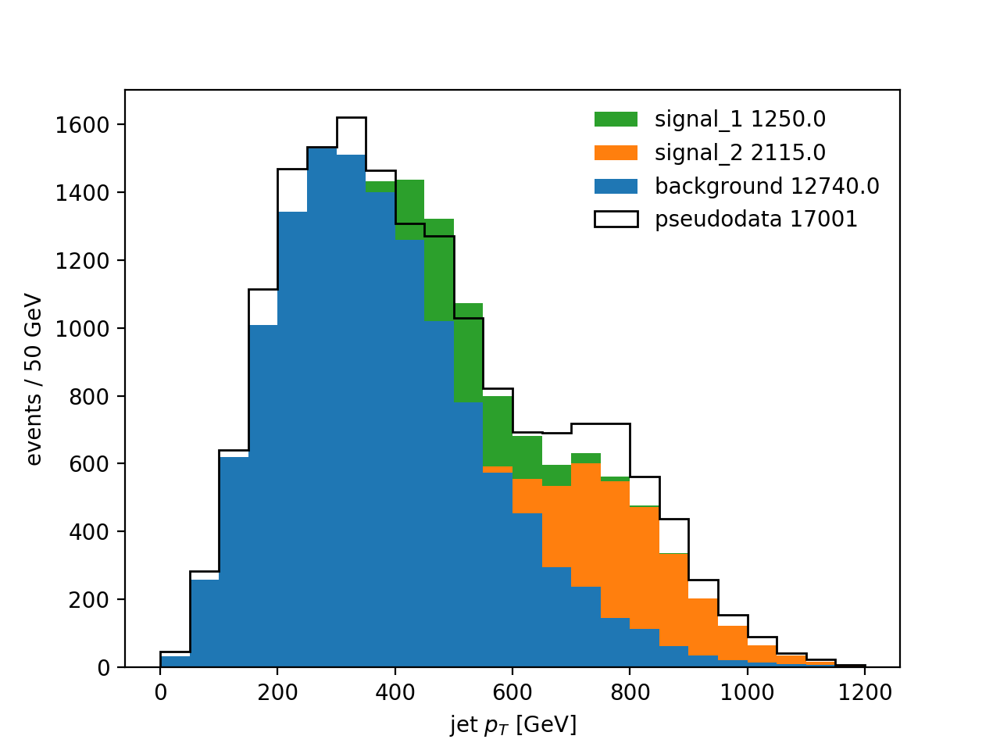

# Template fit toy example
Building an example for a template profile likelihood fit.

## Sample creation
The script ```build_inputs_expression.py``` creates predicted distributions for three processes, as well as the distribution of a fictitious measurement. The figure below visualizes the events created.



The pseudodatata is not an Asimov dataset, but corresponds to a dataset where a normalization factor of 1.05 is applied to the background, and normalization factors 0.7 and 1.3 to the two signal processes.